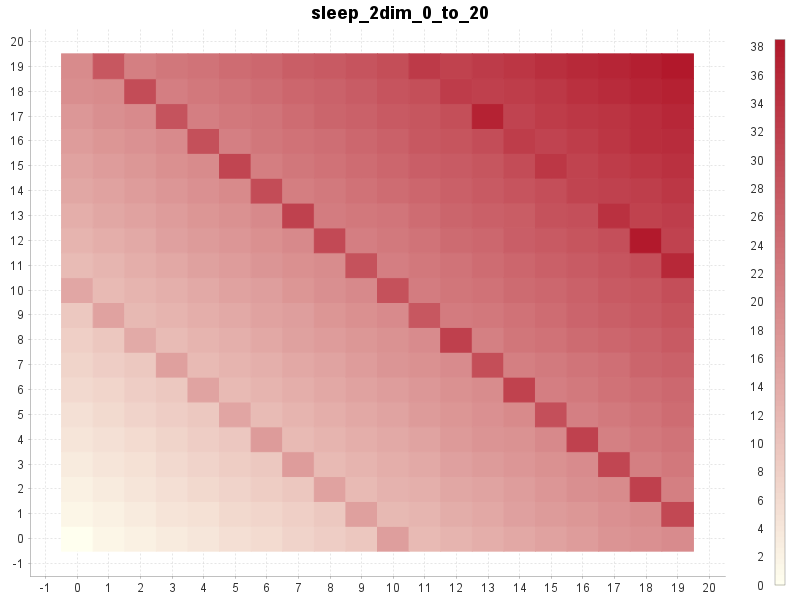

Micro benchmarking library for Java.

# Introduction

Finding out how much time a code snippet takes to do it's job can be surprisingly difficult.

This library hides all of the difficult and annoying parts.
It will automatically
- call the code snippet many times before measuring it
  (hopefully triggering JIT compilation)
- call the code snippet multiple times in a single measurement
  (to enhance measurement granularity, especially for small code snippet)
- measure multiple times
  (to discard outliers and further enhance measurement granularity)
- run multiple code snippets for comparisons
- generate CSV file report
- limit the measurement time to a specified allocated time
- handle special cases
  (for example code snippets that take very long to execute)

## Simple measurement

This will simply run a code snippet and return the elapsed time. 

The `BenchmarkBuilder` will handle the automatic warmup time and
will run the code snippet provided with `measure()` several times
returning the average elapsed time of a single run.

In this example the measured code snippet is the `Thread.sleep()` method.

```java
double elapsedMillis = new BenchmarkBuilder()
        .timeUnit(TimeUnit.MilliSeconds)
        .measure(millis -> {
            try {
                Thread.sleep(millis);
            } catch (InterruptedException e) {
            }
        }, 1234);
System.out.println("sleep(1234) = " + elapsedMillis + " millis");
```

The output will look something like this:
```
sleep(1234) = 1235.5423 millis
```

You can control different aspects of the measurement:

```java
double elapsedMillis = new BenchmarkBuilder()
        .timeUnit(TimeUnit.MilliSeconds)
        .allocatedWarmupSeconds(0.5)
        .allocatedMeasureSeconds(2.0)
        .resultCalculator(ResultCalculators.AVERAGE_LOWER_HALF)
        .measure(millis -> {
            try {
                Thread.sleep(millis);
            } catch (InterruptedException e) {
            }
        }, 1234);
System.out.println("sleep(1234) = " + elapsedMillis + " millis");
```

The output will look essentially the same as before but
you will notice that it takes longer to run (and being more accurate due to more measurements):
```
sleep(1234) = 1234.4354 millis
```

## Benchmark functions with 1 argument

To measure the influence of an argument you need to measure the snippet
multiple times with different argument values.

In this example the measured code snippet is again the `Thread.sleep()` method
compared with a second code snippet that does a busy wait for specified nanoseconds.

```java
private static void busyWait(long nanos) {
    long startNanos = System.nanoTime();
    long targetNanos = startNanos + nanos;
    long endNanos;
    do {
        endNanos = System.nanoTime();
    } while (endNanos < targetNanos);
}
```

```java
new BenchmarkBuilder()
        .csvReport("example_sleep_0_to_100.csv")
        .timeUnit(TimeUnit.MicroSeconds)
        .forLoop(0, 100)
        .benchmark("sleep", millis -> {
            try {
                Thread.sleep(millis);
            } catch (InterruptedException e) {
            }
        })
        .benchmark("busy", millis -> {
            busyWait(millis * 1_000_000);
        })
        .run();
```

This will generate a CSV file with the benchmark measurements
over the provided arguments.

[example_sleep_0_to_100.csv](docu/example_sleep_0_to_100.csv)


The next example uses `.forArguments(1, 10, 100, 1000)`
instead of the `forLoop()` method to provide explicit arguments:

```java
new BenchmarkBuilder()
        .csvReport("example_sleep_1_10_100_1000.csv")
        .allocatedMeasureSeconds(0.1)
        .timeUnit(TimeUnit.MicroSeconds)
        .forArguments(1, 10, 100, 1000)
        .benchmark("sleep", millis -> {
            try {
                Thread.sleep(millis);
            } catch (InterruptedException e) {
            }
        })
        .benchmark("busy", millis -> {
            busyWait(millis * 1_000_000);
        })
        .run();
```

[example_sleep_1_10_100_1000.csv](docu/example_sleep_1_10_100_1000.csv)


The next example is a real world scenario.
It measures the `BigDecimal.divide()` method with increasing precision.

The `forLoop()` iterates over integers and converts
the current value into a instance of `MathContext`.

Please note that all preparations are done outside of the benchmark snippet.
The benchmark snippet contains only the call to `divide()`.
 
```java
BigDecimal v1 = valueOf(1);
BigDecimal v7 = valueOf(7);
new BenchmarkBuilder()
        .csvReport("example_BigDecimal_divide_precision_1_to_1000.csv")
        .forLoop(1, 1000, i -> new MathContext(i))
        .benchmark("divide", mc -> {
            v1.divide(v7, mc);
        })
        .run();
```

[example_BigDecimal_divide_precision_1_to_1000.csv](docu/example_BigDecimal_divide_precision_1_to_1000.csv)


## Benchmark functions with 2 arguments

If your snippet needs 2 arguments you can only run benchmark.
The generated CSV will use the x-axis for one argument
and the y-axis for the other argument.

With 2 arguments only one benchmark snippet is allowed.

```java
new BenchmarkBuilder()
        .csvReport("example_sleep_2dim_0_to_20.csv")
        .allocatedWarmupSeconds(0.01)
        .allocatedMeasureSeconds(0.1)
        .timeUnit(TimeUnit.MilliSeconds)
        .forLoop(0, 20)
        .forLoop(0, 20)
        .benchmark("sleep", (millis1, millis2) -> {
            try {
                Thread.sleep(millis1 + millis2);
            } catch (InterruptedException e) {
            }
        })
        .run();
```

[example_sleep_2dim_0_to_20.csv](docu/example_sleep_2dim_0_to_20.csv)



