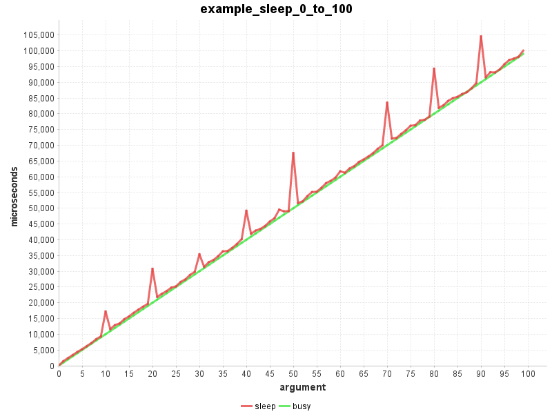
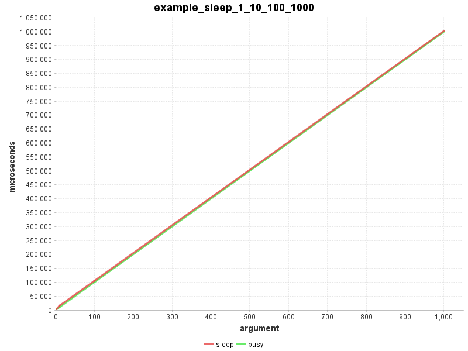
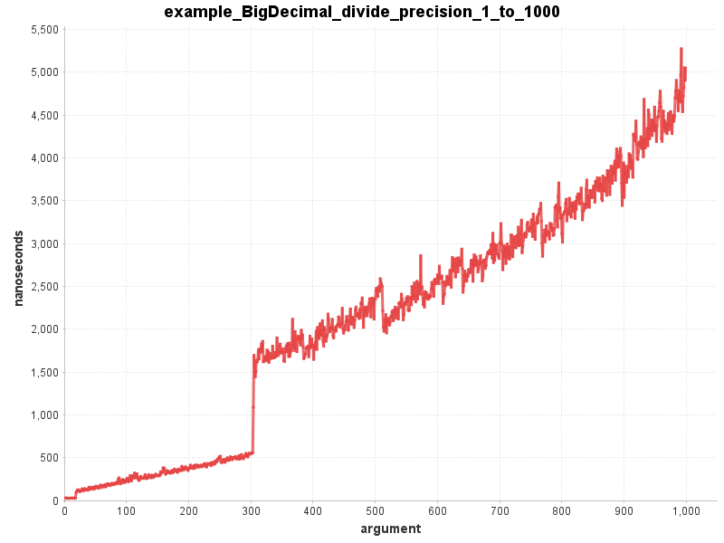

Micro benchmarking library for Java.

# Introduction

Finding out how much time a code snippet takes to do it's job can be surprisingly difficult.

This library hides all of the difficult and annoying parts.

## Simple measurement

This will simply run a code snippet and return the elapsed time. 

The `BenchmarkBuilder` will handle the automatic warmup time and
will run the code snippet provided with `measure()` several times
returning the average elapsed time of a single run.

```java
    public static void exampleSimpleMeasure1() {
        double elapsedMillis = new BenchmarkBuilder()
                .timeUnit(TimeUnit.MilliSeconds)
                .measure(millis -> {
                    try {
                        Thread.sleep(millis);
                    } catch (InterruptedException e) {
                    }
                }, 1234);
        System.out.println("sleep(1234) = " + elapsedMillis + " millis");
    }
```

The output will look something like this:
```
sleep(1234) = 1235.5423 millis
```

You can control different aspects of the measurement:

```java
    public static void exampleSimpleMeasure2() {
        double elapsedMillis = new BenchmarkBuilder()
                .timeUnit(TimeUnit.MilliSeconds)
                .allocatedWarmupSeconds(0.5)
                .allocatedMeasureSeconds(2.0)
                .resultCalculator(ResultCalculators.AVERAGE_LOWER_HALF)
                .measure(millis -> {
                    try {
                        Thread.sleep(millis);
                    } catch (InterruptedException e) {
                    }
                }, 1234);
        System.out.println("sleep(1234) = " + elapsedMillis + " millis");
    }
```

The output will look essentially the same as before but
you will notice that it takes longer to run:
```
sleep(1234) = 1234.4354 millis
```

## Benchmark functions with 1 argument

To measure the influence of an argument you need to measure the snippet
multiple times with different argument values.

```java
    public static void exampleBenchmarkSleep1() {
        new BenchmarkBuilder()
                .csvReport("example_sleep_0_to_100.csv")
                .timeUnit(TimeUnit.MicroSeconds)
                .forLoop(0, 100)
                .benchmark("sleep", millis -> {
                    try {
                        Thread.sleep(millis);
                    } catch (InterruptedException e) {
                    }
                })
                .benchmark("busy", millis -> {
                    busyWait(millis * 1_000_000);
                })
                .run();
    }

    private static void busyWait(long nanos) {
        long startNanos = System.nanoTime();
        long targetNanos = startNanos + nanos;
        long endNanos;
        do {
            endNanos = System.nanoTime();
        } while (endNanos < targetNanos);
    }
```

This will generate a CSV file with the benchmark measurements
over the provided arguments.

[example_sleep_0_to_100.csv](docu/example_sleep_0_to_100.csv)



The next example uses `.forArguments(1, 10, 100, 1000)`
instead of the `forLoop()` method to provide explicit arguments:

```java
    public static void exampleBenchmarkSleep2() {
        new BenchmarkBuilder()
                .csvReport("example_sleep_1_10_100_1000.csv")
                .allocatedMeasureSeconds(0.1)
                .timeUnit(TimeUnit.MicroSeconds)
                .forArguments(1, 10, 100, 1000)
                .benchmark("sleep", millis -> {
                    try {
                        Thread.sleep(millis);
                    } catch (InterruptedException e) {
                    }
                })
                .benchmark("busy", millis -> {
                    busyWait(millis * 1_000_000);
                })
                .run();
    }
```

[example_sleep_1_10_100_1000.csv](docu/example_sleep_1_10_100_1000.csv)




The next example is a real world scenario.
It measures the `BigDecimal.divide()` method with increasing precision.

The `forLoop()` iterates over integers and converts
the current value into a instance of `MathContext`.

Please note that all preparations are done outside of the benchmark snippet.
The benchmark snippet contains only the call to `divide()`.
 
```java
    public static void exampleBenchmarkBigDecimalDivide() {
        BigDecimal v1 = valueOf(1);
        BigDecimal v7 = valueOf(7);
        new BenchmarkBuilder()
                .csvReport("example_BigDecimal_divide_precision_1_to_1000.csv")
                .forLoop(1, 1000, i -> new MathContext(i))
                .benchmark("divide", mc -> {
                    v1.divide(v7, mc);
                })
                .run();
    }
```

[example_BigDecimal_divide_precision_1_to_1000.csv](docu/example_BigDecimal_divide_precision_1_to_1000.csv)




## Benchmark functions with 2 arguments

